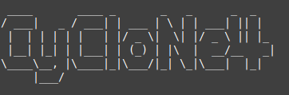
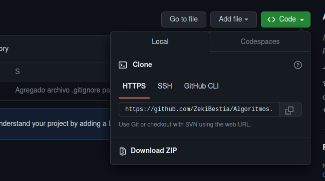
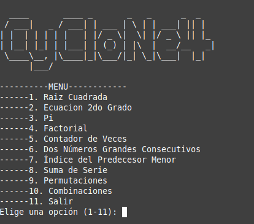

# Algoritmos
<p align="center">
  
</p>


Repositorio de algoritmos matematicos escrito en Python3

## Matematicos
  + Raiz Cuadrada
  + Ecuacion 2do grado
  + PI
  + Factorial
  + Suma de sucesion
  + Permutaciones
  + Combinaciones
## Requisitos de Instalación
Para ejecutar el programa es necesario tener instalado python3
+ Gnu/Linux
  ```py
  python3 --version
  # Si el modulo no fue encontrado:
  sudo apt-install python3
  ```
+ Windows                                               
  Para instalar Python3 en este sistema dirijase a la siguiente liga [Python3](https://docs.python.org/es/3/using/windows.html) 
  

## Instalación y Ejecución
### Instalación
Para instalar el programa puede descargar el zip del repositorio
<p align="center">
  
</p>
O clonar el repositorio de esta manera

```sh
git clone https://github.com/ZekiBestia/Algoritmos.git
```
### Ejecución
Ingrese a la carpeta src y ejecute el archivo main.py
```
cd Algortimos/src/
python3 main.py
```
<p align="center">
  
</p>

## Colaboradores 
## Autores

| [<br><sub>Leonardo Alexis Luna Moreno</sub>](https://github.com/leonardolunamoreno) |  [<br><sub>Ernesto Missael Contreras Emigdio</sub>](https://github.com/Erst086) |  [<br><sub>Ezequiel Olivera Reyes</sub>](https://github.com/zekibestia) |
| :---: | :---: | :---: |

